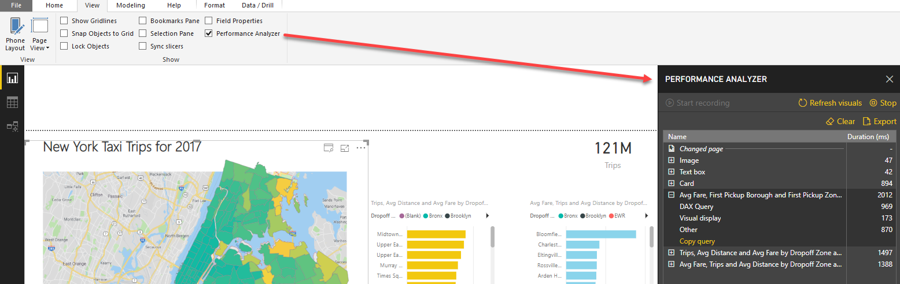
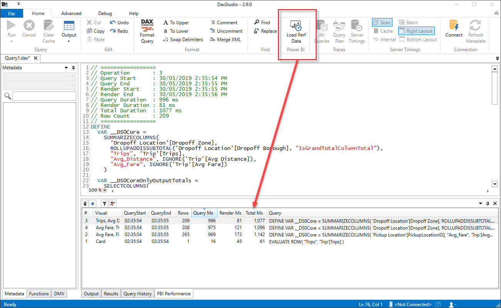

As of May 2019 Power BI Desktop has the ability to run a Performance Analyzer (which can be displayed via the View ribbon)

This allows you to record the timings of various operations within your Power BI report. 

This feature shows you a breakdown of timings for each of your visuals in a tree layout. But you can also export the raw performance data to a json file.

DAX Studio allows you import the performance data and loads into to grid where you can see all the data in a grid where you can sort and filter the data. You can then double-click to bring a single slow query into the editor where you can then work on it to improve the performance.

> _NOTE:_ DAX Studio does not import the _Other_ duration from Power BI as this is largely made up of time where the visual was queued up waiting to be processed. This is due to the fact that the javascript engine which does the rendering in Power BI is single threaded.