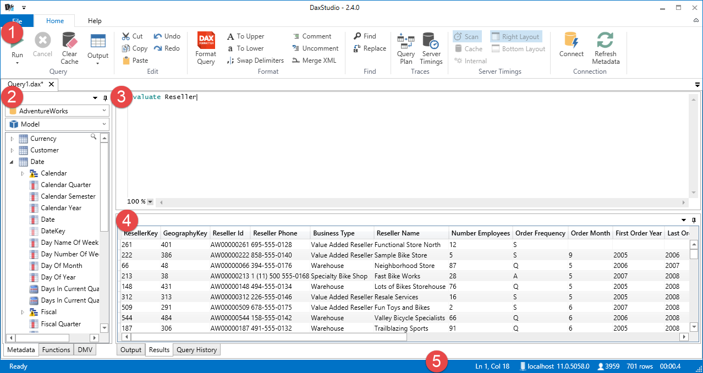

## Main Screen
The following image outlines the main sections of the DAX Studio user interface

1. [Ribbon Control](features/ribbon-control) / [File Menu](features/file-menu)
1. [Metadata Panes](features/metadata-panes)
1. [Query Editor](features/query-editor)
1. [Output Panes](features/output-panes)
1. [Statusbar](features/statusbar)

## Current feature set
Dax Studio works as both an add-in for Excel 2010/2013 and as a standalone program and provides the following functionality:

- Modern User Interface
  - [Flexible Layout](features/flexible-layout)
  - [Multiple Tabs](features/multiple-tabs)
  - Office 2013 like [Ribbon Control](features/ribbon-control)
- Integrated Tracing
  - [Query Plan Trace](features/query-plan-trace)
  - [Server Timing Trace](features/server-timing-trace)
- [New Version notification](features/new-version-notification)
- [Single Installer](installation/single-installer)

## Proposed future feature set
We are always on the look out for new feature ideas. These are kept on the project's [issue list]({{ site.github.issues_url }}). You can vote for existing ideas/issues or add your own.

## Troubleshooting
If you have issues running Dax Studio there are some [logging settings](troubleshooting/logging-settings) that can be enabled to help diagnose the issue.

There is also a small utility called [DAX Studio Checker](troubleshooting/daxstudio-checker) which can help check the configuration of your machine. The links to the 3 external dependencies which Dax Studio requires are listed on the [Installer page](installation/single-installer). 

If you get the error _"Not loaded. A runtime error occurred during the loading of the COM Add-in"_ for the Excel add-in you can try enabling the environment variable as detailed in these instructions [https://www.oneplacesolutions.com/support/0053.html](https://www.oneplacesolutions.com/support/0053.html) to display a more detailed error message

## Credits
Dax Studio is using the following open source libraries, without these it would not exist in it's current state:
- [AvalonEdit](http://avalonedit.net/) - main editor control
- [AvalonDock](https://github.com/xceedsoftware/wpftoolkit) (part of Xceed WPF Toolkit - Community Edition) - Docking UI
- [Caliburn.Micro](https://caliburnmicro.com/) - MVVM framework
- [Fluent Ribbon](https://github.com/fluentribbon/Fluent.Ribbon) - Ribbon control and Office 2013 window style
- [Hardcodet NotifyIcon](http://www.hardcodet.net/wpf-notifyicon) - version update notification messages

