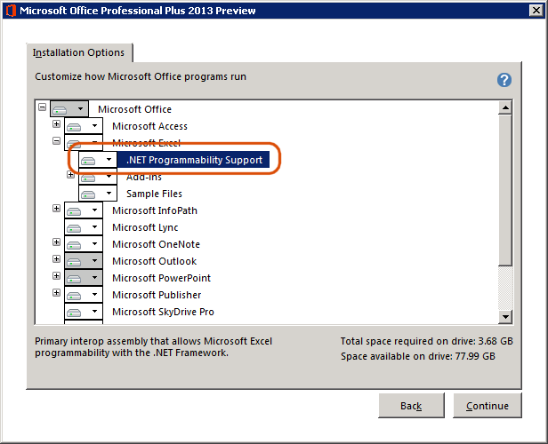

The page details the installation pre-requisites for Dax Studio

## Office 2013 Primary Interop Assemblies

**Installation Instructions**

> Note: Office 2016 and later should have this enabled by default

DAX Studio requires Office Primary Interop Assemblies. Currently, the Office 2013 Primary Interop Assemblies Redistributable is not yet available. However, you can install the Primary Interop Assemblies for Office 2013 (also known as .NET Programmability Support) as follows:

On Windows XP, go to Start... Settings... Control Panel... Add or Remove Programs. Click on your version of Microsoft Office 2013 and click Change. Choose Add or Remove Features.

On Windows 2003, go to Start... Control Panel... Add or Remove Programs. Click on your version of Microsoft Office 2013 and click Change. Choose Add or Remove Features.

On Windows Vista or Windows 2008, go to Start... Control Panel... Classic View... Programs and Features. Right click on your version of Microsoft Office 2013 and choose Change. Choose Add or Remove Features.

On Windows 7 or Windows 10, go to Start... Control Panel... Uninstall a program. Right click on your version of Microsoft Office 2013 and choose Change. Choose Add or Remove Features.

Make sure .NET Programmability Support is set to "Run from My Computer" as shown in the following image:

